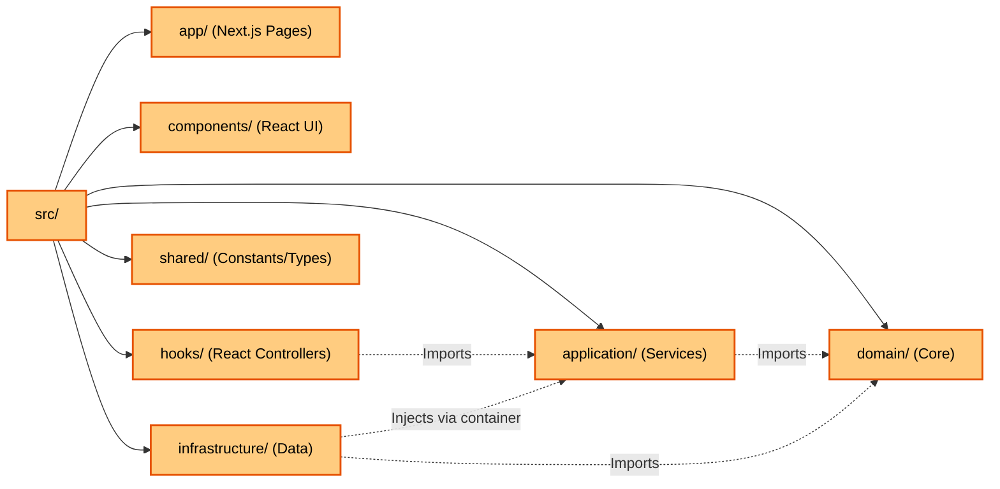
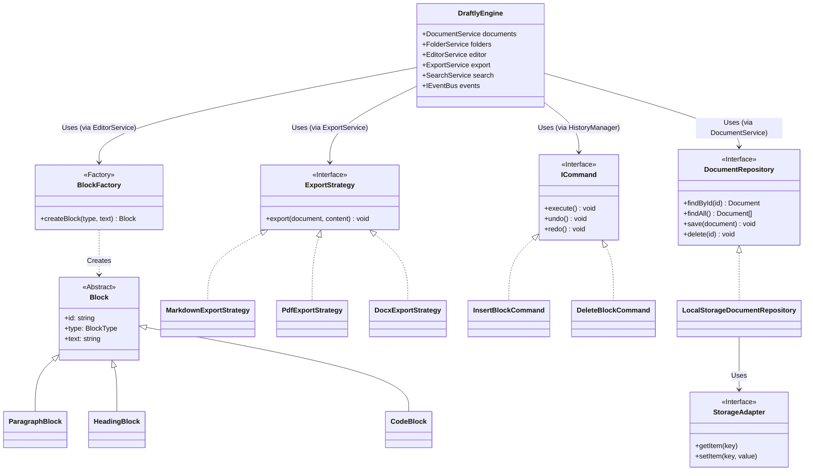
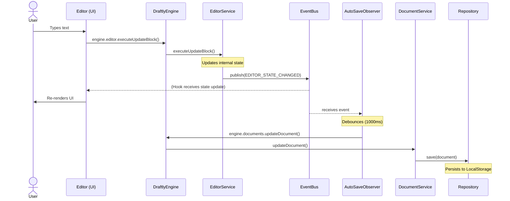
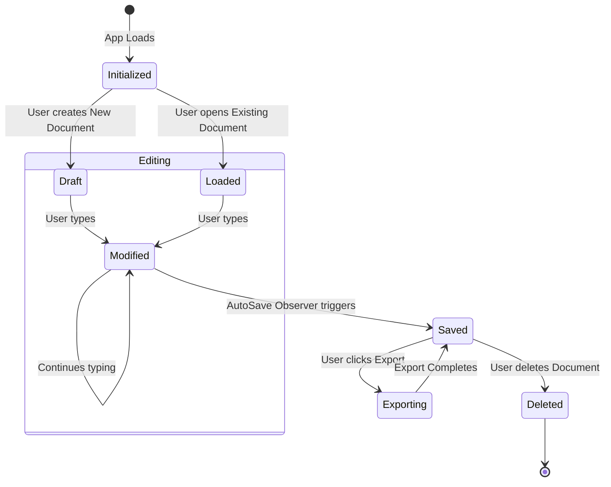

# Draftly v2 - System Architecture

This document contains the structural UML diagrams that describe the high-level design of the Draftly v2 application. The architecture strictly adheres to **Clean Architecture**, **SOLID principles**, and proven **Design Patterns** to ensure a decoupled, scalable, and maintainable codebase.

---

## 1. System Architecture Diagram

This diagram visualizes the layered architecture. Notice how dependencies always point **inwards** toward the Domain Layer (Dependency Inversion Principle).

```mermaid
graph TD
    %% Define Styles
    classDef presentation fill:#4FC3F7,stroke:#01579B,stroke-width:2px,color:#000;
    classDef application fill:#81C784,stroke:#1B5E20,stroke-width:2px,color:#000;
    classDef domain fill:#FFF59D,stroke:#F57F17,stroke-width:2px,color:#000;
    classDef infrastructure fill:#E0E0E0,stroke:#424242,stroke-width:2px,color:#000;

    subgraph Presentation Layer ["Presentation Layer (React UI)"]
        UI[Editor / Sidebar / Topbar]:::presentation
        Hooks[Custom Hooks (useDraftlyEngine)]:::presentation
    end

    subgraph Application Layer ["Application Layer (Services & Facade)"]
        Engine[DraftlyEngine Facade]:::application
        Services[Document, Folder, Editor Services]:::application
        Bus[Global Event Bus]:::application
    end

    subgraph Domain Layer ["Domain Layer (Business Logic)"]
        Entities[Entities: Document, Folder, Blocks]:::domain
        Repos[Repository Interfaces]:::domain
        Patterns[Commands, Factories, Strategies]:::domain
    end

    subgraph Infrastructure Layer ["Infrastructure Layer (Implementation)"]
        LocalStorage[Local Storage Adapter]:::infrastructure
        Mappers[Data Mappers]:::infrastructure
        DI[Dependency Injection Container]:::infrastructure
    end

    %% Dependencies
    UI -->|Uses| Hooks
    Hooks -->|Calls| Engine
    Engine -->|Delegates to| Services
    Services -->|Uses| Entities
    Services -->|Depends on| Repos
    Services -->|Emits Events| Bus
    
    %% Infrastructure Implements Domain
    LocalStorage -.->|Implements| Repos
    Mappers -.->|Serializes| Entities
    
    %% Dependency Injection
    DI -->|Wires| Engine
    DI -->|Injects| LocalStorage
```

---

## 2. Package Diagram

This diagram maps the physical `src/` directory structure to our logical architectural layers.



---

## 3. Class Diagram (Design Patterns Showcase)

This class diagram highlights the primary design patterns used throughout the codebase: **Facade**, **Factory**, **Strategy**, **Command**, and **Repository**.



---

## 4. Sequence Diagram (AutoSave Flow)

This sequence diagram illustrates the reactive flow of data from a user typing in the Editor all the way down to the LocalStorage infrastructure, demonstrating the Observer pattern via the Event Bus.



---

## 5. State Diagram (Document Lifecycle)

This state diagram maps out the various states a `Document` entity can exist in during a user session.


